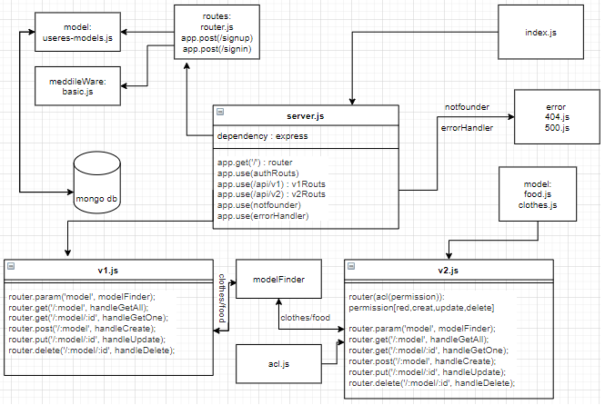

# auth-api
## Author: Anwar Abbass
- tests report: [here](https://github.com/AnwarAbbass/auth-api/actions/runs/879890146)
- front-end : [here](https://auth-api-anwar.herokuapp.com/)
## Setup
- .env requirements
- "base-64"
- "bcrypt"
- "cors"
- "dotenv"
- "express"
- "jsonwebtoken"
- "mongoose"
- "morgan"
- PORT - Port Number

## Running the app
npm start
Endpoint: 
- '/'
- '/signup'
- '/signin'
- '/api/v1/:model'
- '/api/v2/:model'

## Tests
Unit Tests: npm run test

## UML

